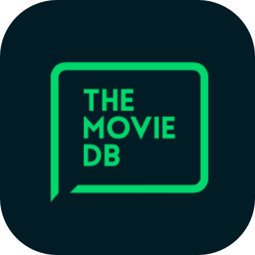
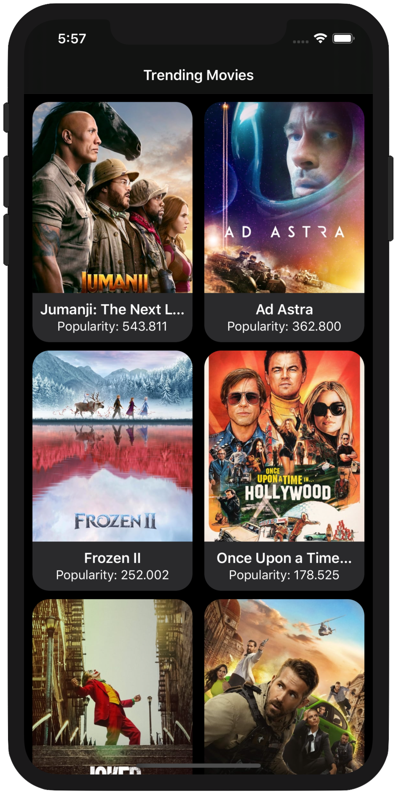
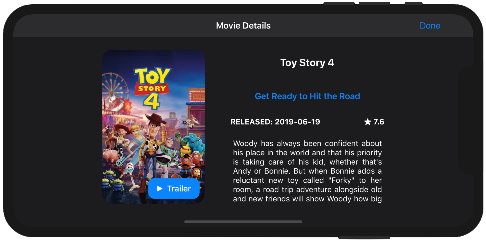
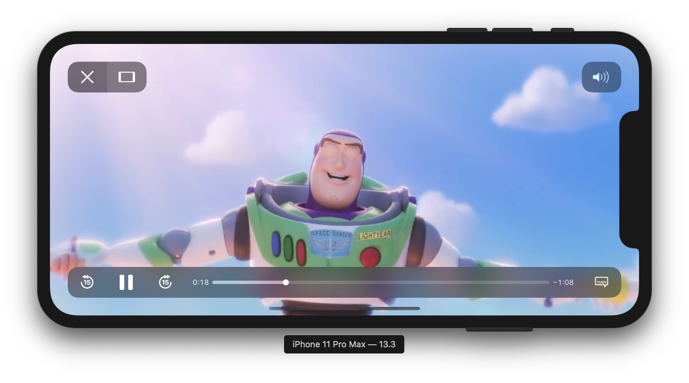
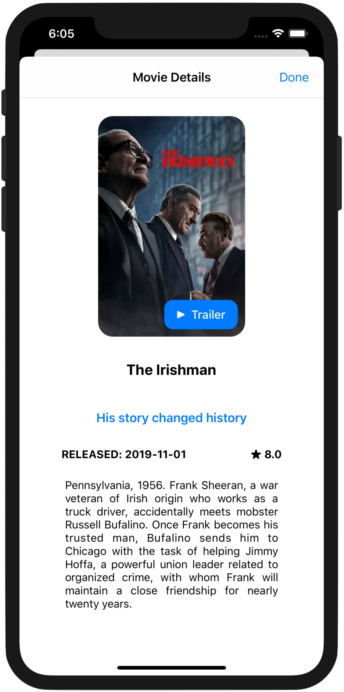

<!-- Header -->

	
	<h1>TheMovieDB App</h1>

  
  
  
  

<!-- Body -->
## Frameworks
- Foundation
- UIKit
- AVKit
- WebKit
- Kingfisher

## Description
The goal of this short project is to create a simple iOS application that fetches Trending Movies from [TheMovieDB API](https://developers.themoviedb.org/3/getting-started/introduction) showing them in a nice interface, with their correspondent movie details and being able to play their trailers within the app.

Movies are displayed using a CollectionView object and adapting the autolayout to landscape and portrait modes by traits variations.

  
  

The app adapts properly to light and dark mode as well and video is played through a WKWebView object. ViewControllers are presented modally according the new iOS13 look, not adapting to fullscreen by default.

  
  

## App preview
On the app preview is displayed the functionality described previously and the app's flow itself.

  

## References
- [The Movie DB API documentation](https://developers.themoviedb.org/3/getting-started/introduction)

<!-- Footer -->