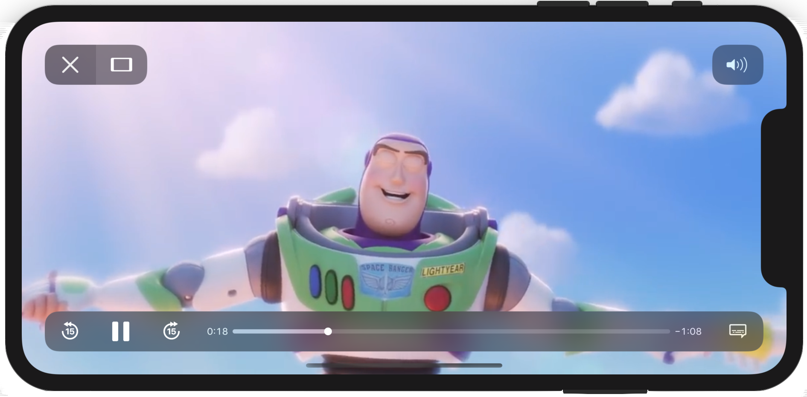

<!-- Header -->

<h1>TheMovieDB App</h1>

<!-- Body -->
## Documentation
- [The Movie DB API](https://developers.themoviedb.org/3/getting-started/introduction)

## Frameworks/External dependencies
- Foundation
- UIKit
- AVKit
- WebKit
- Kingfisher

## Description
The purpose of this app is to create a quick concept that, using The Movie DB API, **fetches trending movies and shows them in a clean interface**. Tapping on any movie a new view is presented **displaying the movie details** and allowing the user to **play the trailer within the application itself**.

Movies are displayed using a collection-view object adapting the view to landscape and portrait modes by the **traits variations usage**.

	
	

Filtering movies through the search bar is made with the implementation of **DiffableDataSource snapshots**, making the actual user experience smooth and transparent besides of update data in real time.

	

Finally the app adapts properly to **light and dark mode** as well and the trailer is played through a WKWebView object.

	
	

## Preview
The app preview presents the functionality and overall flow.

	

<!-- Footer -->